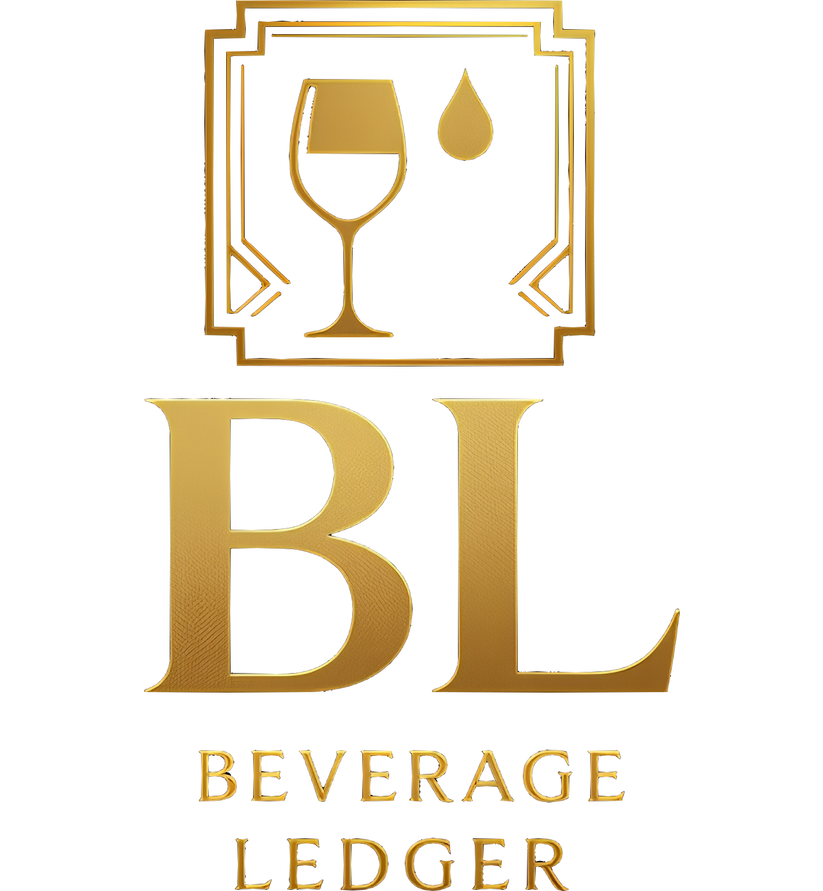

<div align="center">
  
  
  # Encore Beverage Ledger
  **Professional Casino Liquor Inventory Management System**
  
  [](https://nextjs.org/)
  [](https://www.typescriptlang.org/)
  [](https://tailwindcss.com/)
  [](#-copyright-notice)
</div>

---

## 🚨 **LEGAL DISCLAIMER**

> **⚠️ IMPORTANT NOTICE**: This software is an **INDEPENDENT PROJECT** and is **NOT affiliated, associated, authorized, endorsed by, or in any way officially connected** with any casino, resort, gaming company, or hospitality business. 
> 
> Any trade names, logos, or brand names mentioned are used for **EDUCATIONAL AND DEMONSTRATIVE PURPOSES ONLY** and are the property of their respective owners.
> 
> This is a **GENERIC INVENTORY MANAGEMENT SYSTEM** that can be adapted for various hospitality environments.

---

## 🎰 About the Project

The **Encore Beverage Ledger** is a sophisticated, casino-themed liquor inventory management system designed for premium casino operations. This application provides comprehensive tracking, management, and reporting capabilities for beverage operations in high-end casino environments.

### ✨ Key Features

- **🍾 Real-time Inventory Tracking** - Monitor liquor bottles and cases with precision
- **📊 Advanced Analytics** - Comprehensive statistics with customizable time ranges
- **📋 Movement History** - Complete audit trail of all inventory transactions
- **🧾 PDF Invoice Generation** - Professional invoice creation with casino branding
- **🎨 Casino-themed UI** - Elegant gold and black design matching casino aesthetics
- **📱 Responsive Design** - Optimized for desktop, tablet, and mobile devices
- **🔍 Smart Search & Filtering** - Quick access to specific liquors and movements
- **⚡ Performance Optimized** - Built with Next.js 15 and modern React patterns

### 🎯 Target Environment

This system is purpose-built for:
- **Premium casino operations** and beverage management
- High-volume liquor inventory management
- Professional casino hospitality environments
- Real-time tracking of premium spirits and wines

---

## 🛠️ Technology Stack

### Frontend
- **Next.js 15.5.2** - React framework with App Router
- **TypeScript** - Type-safe development
- **Tailwind CSS** - Utility-first styling with custom casino theme
- **React Hooks** - Modern state management with useReducer patterns

### Backend & Database
- **Neon Database** - Serverless PostgreSQL
- **Server Actions** - Type-safe server functions
- **PDF Generation** - Custom invoice creation

### Architecture
- **Component-based Design** - 13 modular, reusable components
- **Clean Code Principles** - Maintainable and scalable codebase
- **Type Safety** - Complete TypeScript implementation
- **Responsive Design** - Mobile-first approach

## 📁 Project Structure

```
encore-beverage-ledger/
├── public/
│   ├── ebl-logo.png          # Casino branding logo
│   └── favicon.ico
├── src/
│   ├── app/
│   │   ├── actions.ts        # Server actions for movements
│   │   ├── actions-licores.ts # Liquor data management
│   │   ├── layout.tsx        # App layout
│   │   ├── page.tsx          # Main application (432 lines, refactored from 1460)
│   │   └── api/              # API routes
│   └── components/
│       ├── Calendar/         # Date selection component
│       ├── Modals/          # Confirmation and cancellation modals
│       ├── MovementCard/    # Individual movement display
│       ├── Navigation/      # Section navigation tabs
│       ├── NotificationSystem/ # Toast notifications
│       ├── ScrollToCheckoutButton/ # UX enhancement
│       └── Sections/        # Main content sections
│           ├── SelectionSection.tsx    # Liquor selection interface
│           ├── HistorySection.tsx      # Movement history
│           └── StatisticsSection.tsx   # Analytics dashboard
├── tailwind.config.js       # Custom casino theme configuration
└── README.md
```

---

## 🎨 Design Philosophy

The application embraces a **casino aesthetic** with:
- **Gold Accent Color** (`#D4AF37`) - Representing luxury and elegance
- **Dark Background** (`#120006`) - Professional casino atmosphere
- **Smooth Animations** - Sophisticated transitions between sections
- **Typography** - Clean, readable fonts suitable for operational use
- **Responsive Layout** - Optimized for various screen sizes and devices

---

## 👨‍💻 Author

**Tomás Córdoba Urquijo**
- Software Developer & Technology Specialist

---

## ⚠️ IMPORTANT DISCLAIMER

**TRADEMARK NOTICE**: This software is an independent project and is **NOT officially affiliated, endorsed, sponsored, or approved** by any casino, resort, or hospitality company. Any similarities to existing casino operations or brands are purely coincidental.

**INTENDED USE**: This system is designed as a general-purpose beverage inventory management solution that can be adapted for various hospitality environments.

**LIABILITY**: The author assumes no responsibility for any trademark infringement claims or legal issues arising from the use of this software.

**📋 For complete legal terms, see [DISCLAIMER.md](./DISCLAIMER.md)**

---

## 🚫 COPYRIGHT NOTICE

**© 2025 Tomás Córdoba Urquijo. All Rights Reserved.**

This software is proprietary and confidential. Unauthorized copying, distribution, modification, public display, public performance, or other use of this software and associated documentation files is strictly prohibited and may violate copyright law.

### 🔒 Licensing

**NO PERMISSION IS GRANTED TO:**
- Copy, modify, or distribute this software
- Use this software for commercial or personal purposes without explicit written authorization
- Create derivative works based on this software
- Reverse engineer or decompile this software

**⚠️ IMPORTANT:** This software may only be used with explicit written authorization from Tomás Córdoba Urquijo.

For licensing inquiries, contact: **Tomás Córdoba Urquijo**

### ⚖️ Legal Protection

This software and all associated materials are protected under:
- Copyright laws
- International copyright treaties  
- Intellectual property laws and treaties

**Violation may result in civil penalties, criminal prosecution, monetary damages, and permanent injunction.**

---

<div align="center">
  
</div>
